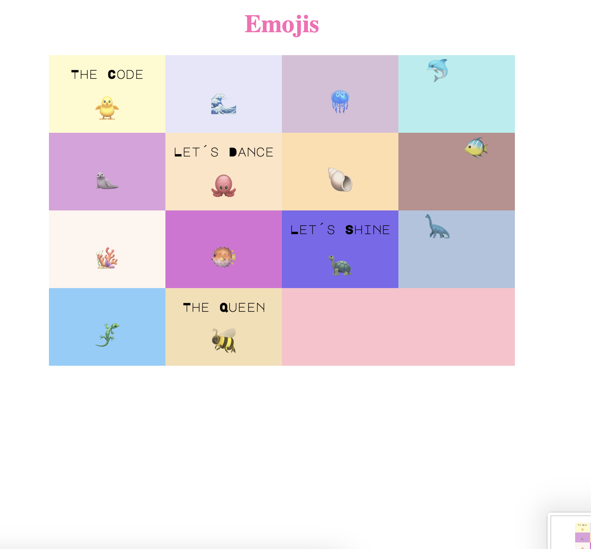
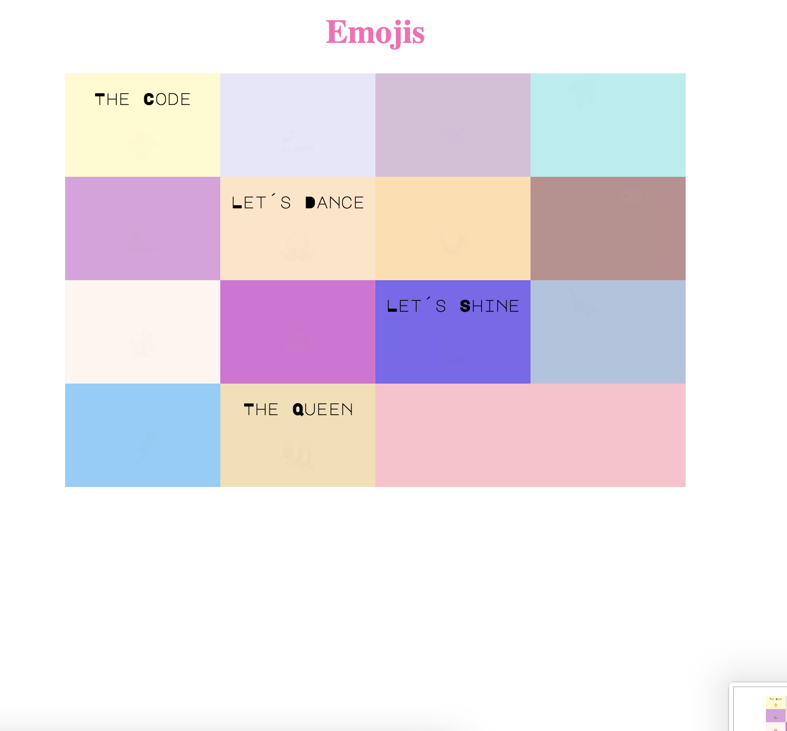

# Ejercicios-HTML5---Reproducir
<!-- Elige un tema de la página de emojis proporcionado y reproduce la siguiente  
 imagen. Cada rectángulo deberá tener un emoji. Página de emojis:https:/Eemojikeyboard.top/es/ -->

